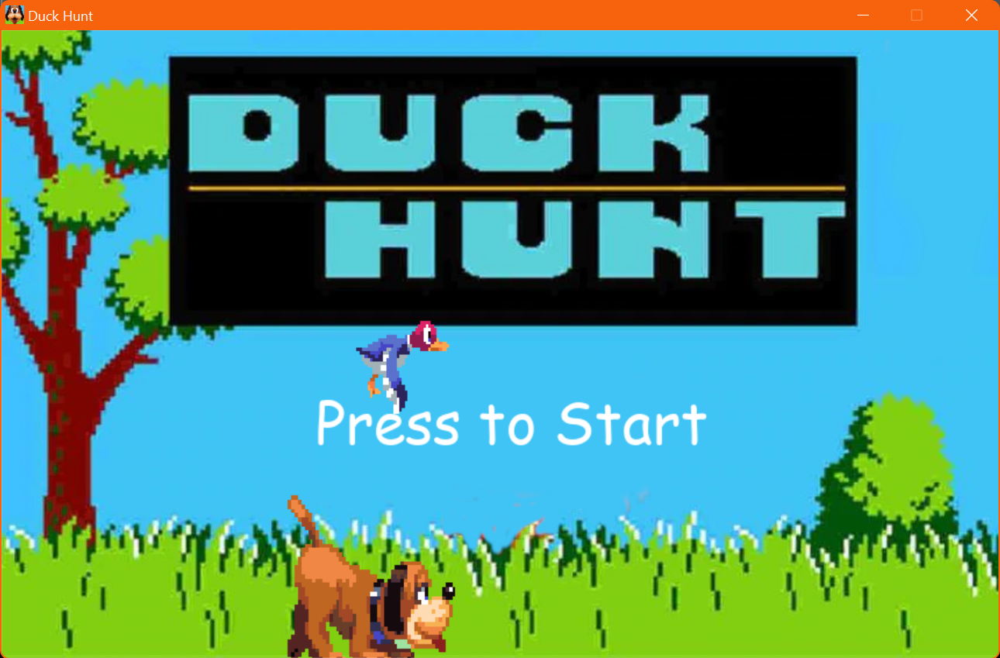
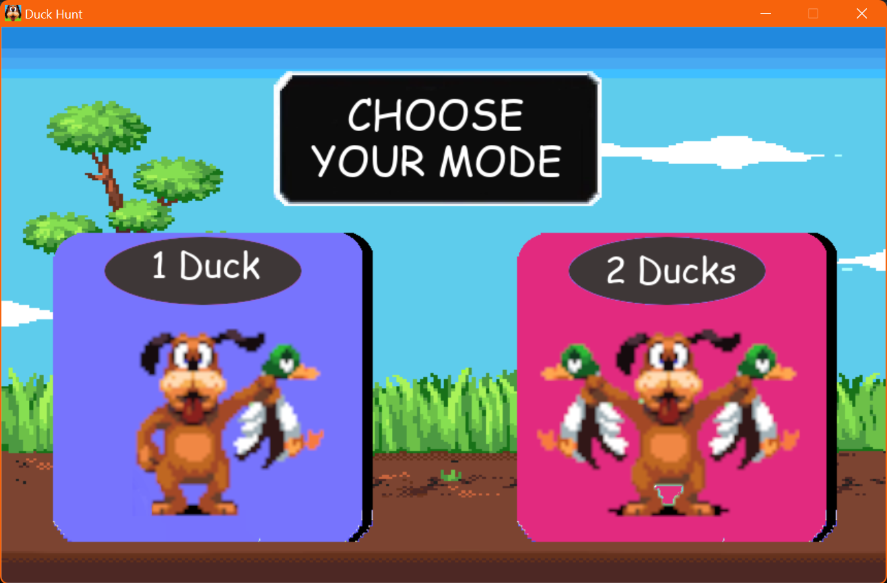
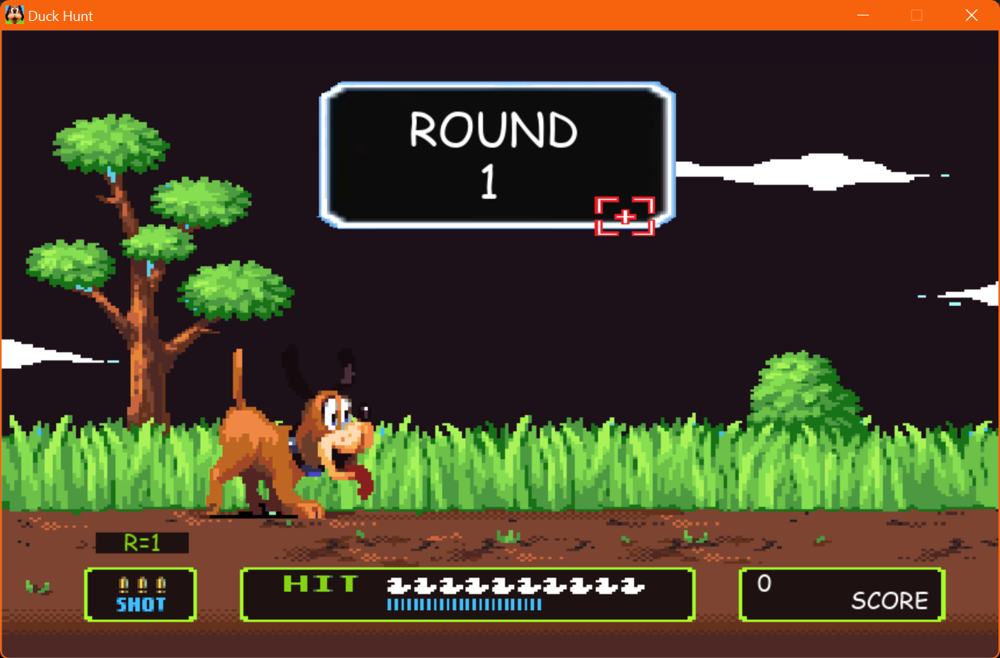
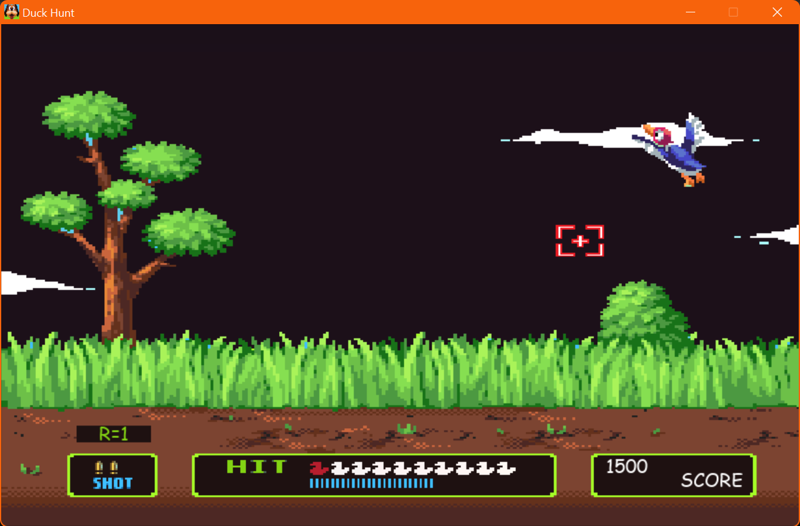
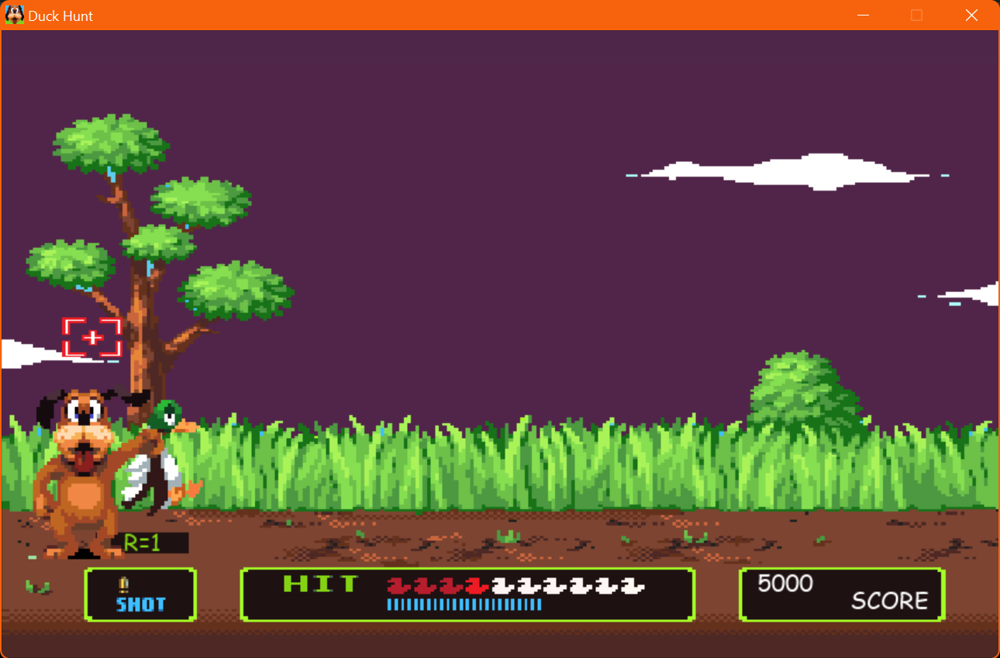

  <br/>

The classic NES game made with Python programming language + Pygame framework

 
<br/>

# Screens







<br/>


# Installation

```GNU/Linux ```
```
git clone https://github.com/daviiid99/Duck_Hunt.git Duck_Hunt
cd Duck_Hunt
python3 main.py
```
<br/>

``` Microsoft Windows```
```
git clone https://github.com/daviiid99/Duck_Hunt.git Duck_Hunt
cd Duck_Hunt
python main.py
```
